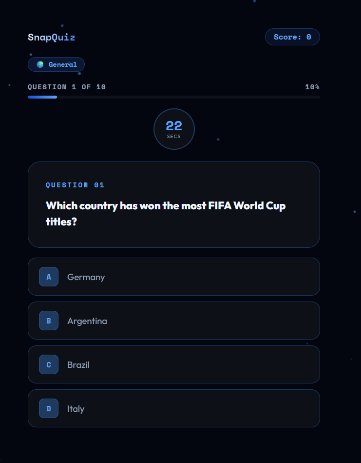
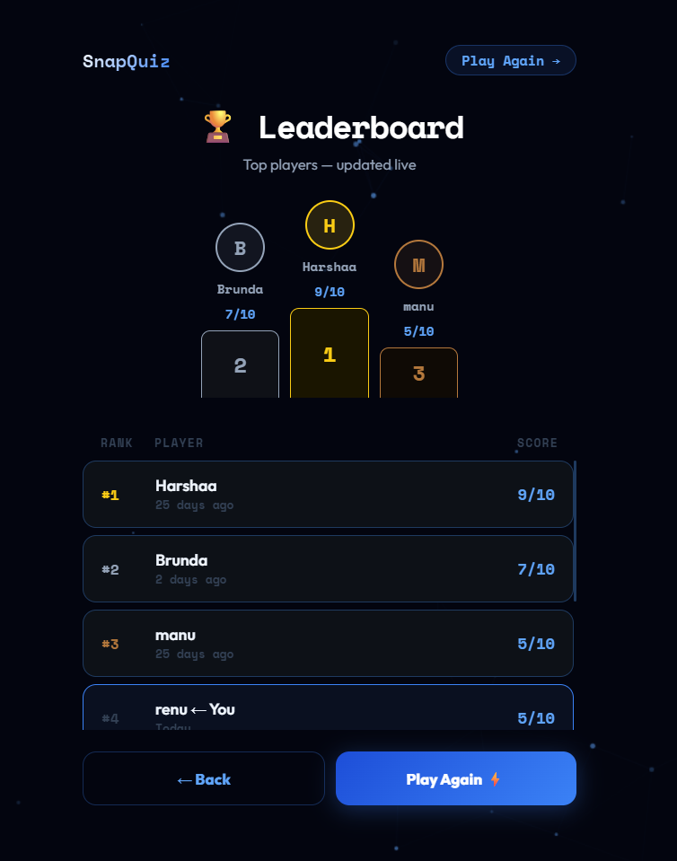

# SnapQuiz 🎯

SnapQuiz is a full-stack quiz web application that allows users to answer quiz questions, track scores in real time, and view leaderboard rankings. The application features a responsive user interface, countdown timer, progress tracking, and result analytics.

---

## 🚀 Features

- 🧠 Interactive quiz system
- ⏳ Countdown timer for each quiz
- 📊 Progress tracking and result analytics
- 🏆 Real-time leaderboard
- 💾 Score saving using MongoDB
- 📱 Responsive UI design
- ✨ Animated particle background

---

## 🛠️ Tech Stack

### Frontend
- HTML
- CSS
- JavaScript

### Backend
- Node.js
- Express.js

### Database
- MongoDB

---

## 📂 Project Structure

```bash
SnapQuiz/
│
├── public/
│   ├── index.html
│   ├── style.css
│   ├── script.js
│
├── screenshots/
│   ├── home.png
│   ├── quiz.png
│   └── leaderboard.png
│
├── routes/
├── models/
├── index.js
├── package.json
├── README.md
└── .gitignore
```

---

## ⚙️ Installation & Setup

### 1️⃣ Clone the Repository

```bash
git clone https://github.com/yourusername/snapquiz.git
```

### 2️⃣ Navigate to Project Folder

```bash
cd snapquiz
```

### 3️⃣ Install Dependencies

```bash
npm install
```

### 4️⃣ Configure Environment Variables

Create a `.env` file and add:

```env
MONGO_URI=your_mongodb_connection_string
PORT=3000
```

### 5️⃣ Start the Server

```bash
node index.js
```

or

```bash
npm start
```

---


## 📸 Screenshots

### Home Page


### Quiz Page


### Leaderboard


---

## 🔌 API Endpoints

| Method | Endpoint | Description |
|--------|----------|-------------|
| GET | `/scores` | Fetch leaderboard scores |
| POST | `/scores` | Save player score |

---

## 📌 Future Improvements

- User authentication
- Multiple quiz categories
- Difficulty levels
- Dark mode support
- Multiplayer quiz mode

---

## 👨‍💻 Author

**Manasvi**

🔗 GitHub: [View Project](https://github.com/yourusername/snapquiz)

---

## 📄 License

This project is licensed under the MIT License.
